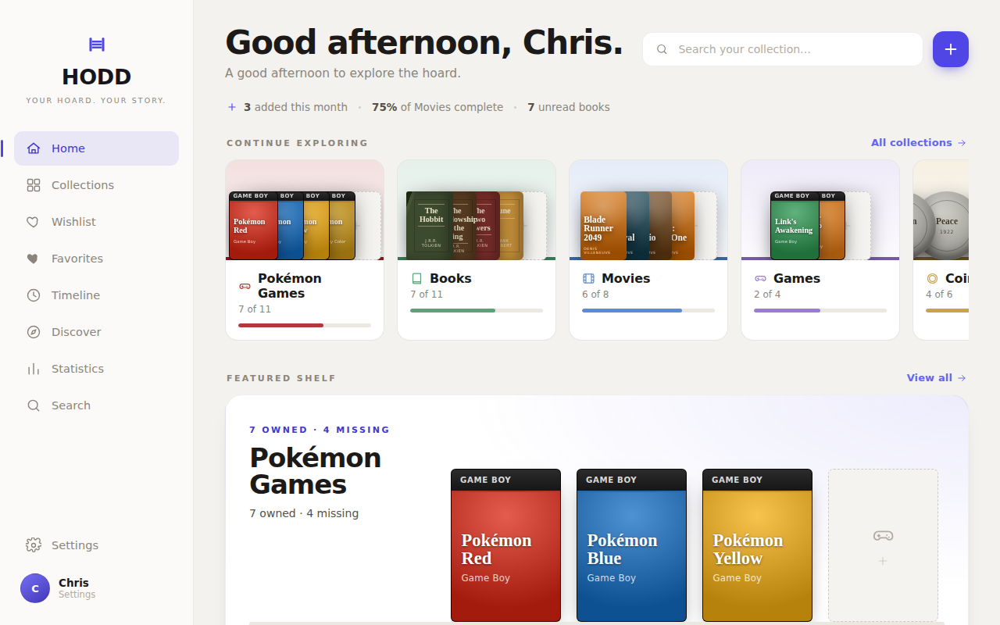
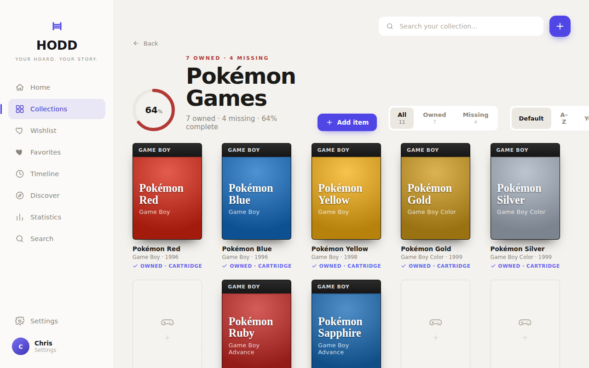
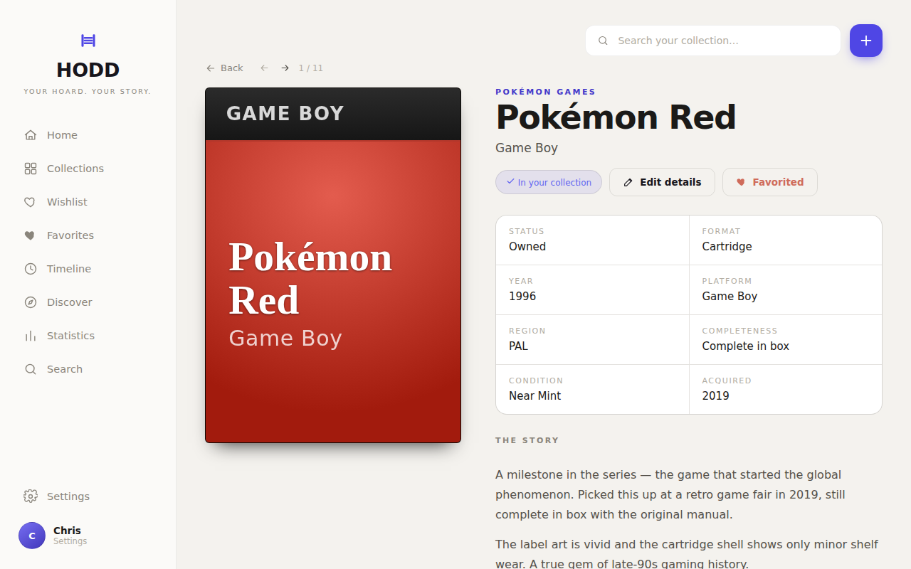
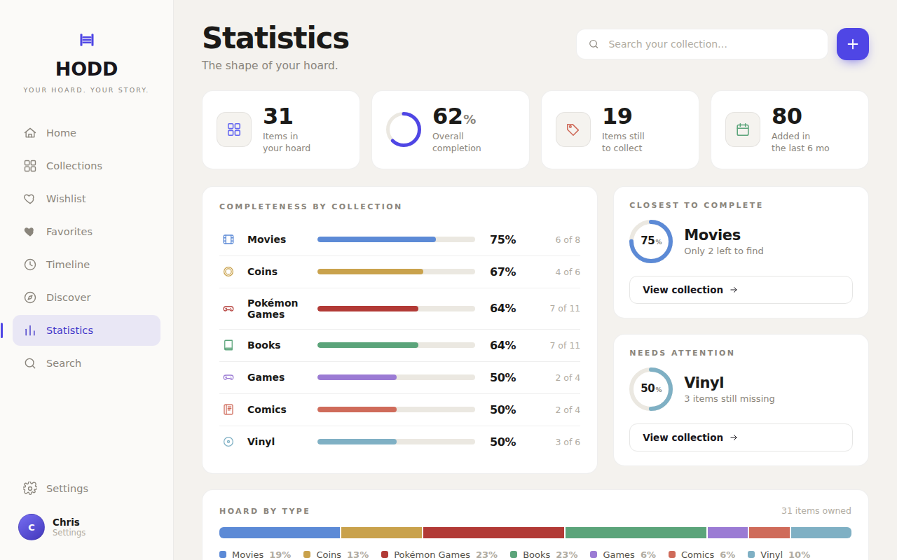

<p align="center">
  
</p>

<h1 align="center">HODD</h1>
<p align="center"><strong>Your hoard. Your story.</strong><br/>A local-first desktop companion for the things you collect.</p>

<p align="center">
  
  
  
  
</p>

---

HODD is a desktop app for collectors who want a beautiful, private home for their things. Games, books, movies, coins, comics, vinyl — or anything else. Your data lives on your device. No subscriptions, no cloud sync, no accounts.

## Screenshots

<table>
  <tr>
    <td></td>
    <td></td>
  </tr>
  <tr>
    <td><em>Home — greeting, featured shelf, quick stats</em></td>
    <td><em>Collection detail with procedurally generated covers</em></td>
  </tr>
  <tr>
    <td></td>
    <td></td>
  </tr>
  <tr>
    <td><em>Item detail — facts, story, and provenance</em></td>
    <td><em>Statistics — completeness across all collections</em></td>
  </tr>
</table>

## Features

**Collections that feel like yours**
Six built-in types (Game, Book, Movie, Coin, Comic, Vinyl) plus unlimited custom collections. Each item gets a procedurally generated cover — no images required — or you can attach your own photos.

**Every detail, your way**
Track format, condition, edition, pressing, completeness, acquisition date, and more. Write a provenance story for any item, or let the on-device AI write one.

**On-device AI with Ollama**
Connect a local [Ollama](https://ollama.ai) instance for AI-powered item enrichment, natural-language search, and story generation. Everything stays on your machine.

**Online metadata lookups**
Fetch metadata from OpenLibrary, MusicBrainz, RAWG (games), and OMDB (movies) — API keys optional.

**Views for every mood**
Home, Collections, Wishlist, Favorites, Timeline, Discover, Statistics, Search. Two layout modes for home and collections. Light and dark themes with six accent palettes.

**Your data, always**
SQLite database in your app data folder. Full archive export and import as JSON. Nothing leaves your machine without your say-so.

## Download

Grab the latest release for your platform from the [Releases](https://github.com/madsendev/hodd/releases) page:

| Platform | Format |
|----------|--------|
| macOS | `.dmg` |
| Windows | `.exe` installer |
| Linux | `.AppImage` |

## Development

```bash
npm install
npm run dev        # Vite + Electron, hot-reloading
```

The renderer runs on `http://localhost:5173`. Electron auto-restarts when main-process files change.

**Checks before shipping:**

```bash
npm run typecheck  # TypeScript across renderer + main + preload
npm test           # Vitest unit tests
npm run build      # Full production build
npm run package    # Build + electron-builder → release/
```

Output directories: `dist/` (React bundle), `dist-electron/` (main + preload), `release/` (packaged app).

## Keyboard shortcuts

| Key | Action |
|-----|--------|
| `Cmd/Ctrl+K` | Open quick-add modal |
| `←` / `→` | Browse items within a collection |
| `F` | Toggle favorite (item detail) |
| `Escape` | Close any overlay or modal |

## Stack

| Layer | Technology |
|-------|-----------|
| Desktop shell | Electron 42, context-isolated preload |
| Renderer | React + TypeScript + Vite |
| Storage | SQLite via sql.js, persisted to `userData/hodd.db` |
| Styling | Custom CSS design system |
| AI | Ollama (llama3.2, mistral, phi3) |
| Packaging | electron-builder |
| Testing | Vitest |

## Theming

HODD ships with a full theme engine: light/dark mode, six accent palettes (Indigo, Forest, Ocean, Gold, Brick, Sky), two headline font choices, and shelf art modes (covers or spines).
